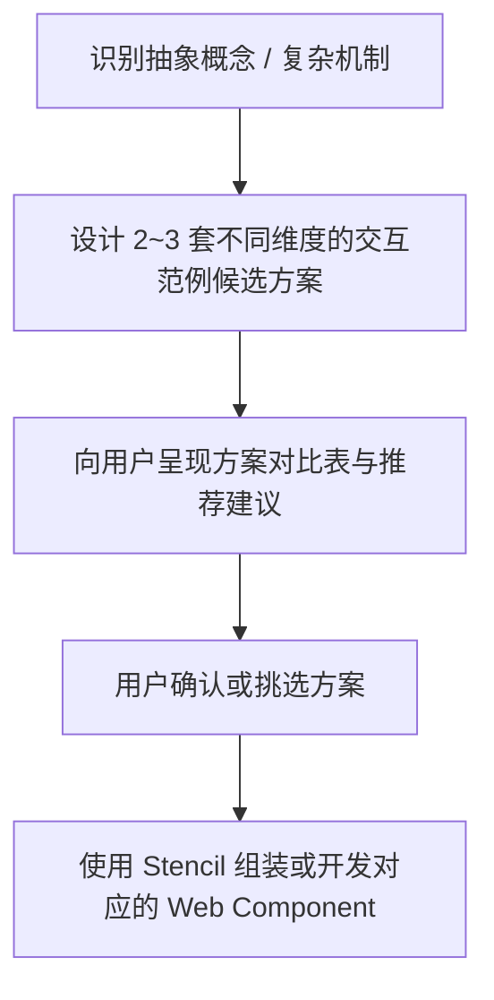

# 高密度培训课件：复杂内容交互范例设计规范与方案推荐库

在专业技术培训与高校深度课程（如 AI 历史与大模型底层推断）中，**静态文本和要点列表无法有效传递底层运行机制**。
本规范确立核心铁律：**凡涉及复杂算法、多层架构、超参数流动或抽象数学概念，必须使用网页内可真实操作、动态计算、透视状态的 Web Component 范例**。

---

## 一、方案生成与用户选择机制（强制流程）

在使用本 Skill 构建或改写课件的过程中，当遇到需要阐释复杂机制的知识点时，**智能体严禁直接堆砌文字或自作主张直接编码**。必须遵循以下三步交互机制：



### 提问模板规范

向用户汇报方案时，必须包含以下四个维度：

```markdown
针对【知识点名称】（例如：Softmax 温度采样机制），设计了以下 3 种可真实操作的交互范例方案，请选择最符合教学重点的方案：

| 方案 | 交互形态与核心组件 | 教学洞察（学生能学到什么） | 交互控件设计 | 推荐度 |
| :--- | :--- | :--- | :--- | :--- |
| **方案 A · 参数滑块与实时概率分布塑形** | `<parameter-slider>` / 动态 Softmax 条形图 | 直观感受温度 $T$ 对分布平滑度与长尾词元概率的直接影响 | 温度滑块 (0.05~1.5) + Top-P 核采样滑块 + 采样模式状态标签 | ★★★ (强烈推荐) |
| **方案 B · 逐词元单步采样推流模拟器** | `<step-pipeline>` / 词元生成器 | 观察大模型自回归循环（前向传播 -> 采样 -> 拼回上下文） | 单步推断按钮 + 候选词概率转盘 + 实时上下文追加 | ★★☆ |
| **方案 C · 贪心 vs 高温双文本生成对照沙盒** | `<layout-split>` + `<interactive-sandbox>` | 对比同一 Prompt 在极端低温与高温下的生成文本差异 | 输入框 + 运行按钮 + 双栏对比卡片 | ★★☆ |

请回复方案序号（例如：“选方案 A”），或提出自定义定制需求。
```

---

## 二、六大常用交互范例模式库

### 模式 1：动态参数滑块与概率分布（Parameter Slider & Distribution）
- **核心组件**：`<parameter-slider>`
- **适用场景**：温度（Temperature）、Top-K、Top-P、学习率（Learning Rate）、惩罚系数（Frequency Penalty）。
- **交互要素**：
  - 范围滑动条（带刻度与典型区间提示，如“冷/确定性”、“平衡区”、“高散度发散”）；
  - 实时重算并重排的条形图，带有动画平滑过渡；
  - 动态状态说明卡片（解释当前参数组合在学术或工程上的后果）。

### 模式 2：分步流程状态机与穿透透视（Interactive Stepper & Inspector）
- **核心组件**：`<interactive-stepper>`
- **适用场景**：一次请求的五层路径、Transformer 前向传播全链路、RAG 向量检索管道、反向传播梯度流。
- **交互要素**：
  - 顶部管道节点导航（显示当前阶段、已完成阶段与未开始阶段）；
  - 下一步 / 上一步按钮，支持前后任意穿透跳转；
  - 双栏布局：左栏为运行机制深度讲解，右栏为**实时底层状态透视窗口**（展示真实 HTTP 报文、张量维度、输入 ID 或中间状态 JSON）。

### 模式 3：实时输入与词元探针（Tokenizer & Vocabulary Explorer）
- **核心组件**：`<tokenizer-playground>`
- **适用场景**：BPE 分词、多语言/古汉语编码惩罚、专有名词切分、词表查找机制。
- **交互要素**：
  - 预设经典语料按钮（文言史料、现代论文、混合代码）；
  - 实时多色交替词元芯片（鼠标悬浮查看 UTF-8 字节大小与 Token ID）；
  - 宏观统计指示器（字符数、词元数、压缩比、词表空间占比）。

### 模式 4：高维几何空间与余弦探针（Vector & Cosine Inspector）
- **核心组件**：`<vector-inspector>`
- **适用场景**：词嵌入（Embedding）、语义相似度、正交性、向量代数（词向量加减法）。
- **交互要素**：
  - 向量维度实时滑动调节器；
  - 语义预设组合（同义概念、跨领域正交概念、反义对立概念）；
  - 余弦相似度动态弧度与仪表盘、空间夹角 $\theta$ 计算器、详细点积与模长推导展示。

### 模式 5：注意力权重与矩阵热力图（Attention Matrix Heatmap）
- **适用场景**：Self-Attention 机制、因果掩码（Causal Masking）、交叉注意力（Cross-Attention）。
- **交互要素**：
  - $N \times N$ 矩阵网格，单元格颜色深浅对应注意力权重分数；
  - 鼠标悬停在特定词元上，高亮与其关联最紧密的上下文词元连接线。

### 模式 6：硬件算力与显存开销模拟器（Hardware & Memory Calculator）
- **核心组件**：`<layout-kpi-grid>`
- **适用场景**：KV Cache 计算、显存带宽瓶颈（Memory Bandwidth Bound）、吞吐量 TPS 测算。
- **交互要素**：
  - 模型参数量（7B / 14B / 72B）与批次大小（Batch Size）输入；
  - 实时计算显存占用图表（模型权重占用、KV Cache 占用、激活值占用）；
  - 提示首字延迟（TTFT）与解码阶段的显存访存开销对比。

---

## 三、Web Component 编写质量准则

1. **响应迅速，零卡顿**：交互事件的响应延迟必须 $< 50\text{ms}$，数学重算直接在客户端执行。
2. **状态透明可观察**：任何滑块调节都必须有直观的数值变化与视觉反馈，避免“静默改变”。
3. **保留预设样本**：务必提供 2~4 个精心挑选的典型业务或课程预设（Presets），方便现场演讲者一键演示典型边界情况。
4. **自适应 16:9 视口**：交互容器必须在 16:9 画布内自适应伸缩，禁止遮挡底部状态栏与上一页/下一页控件。
